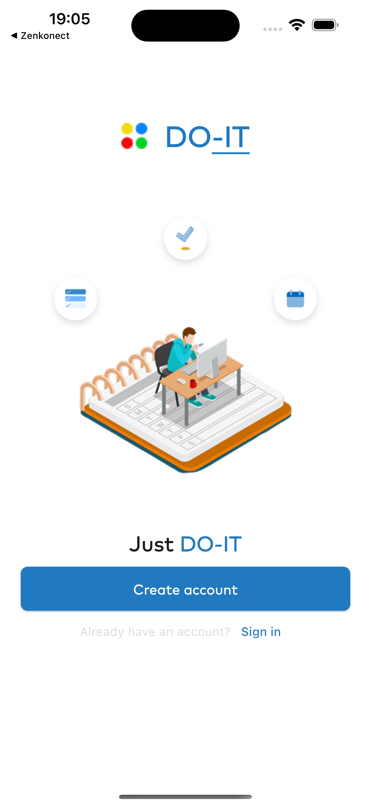
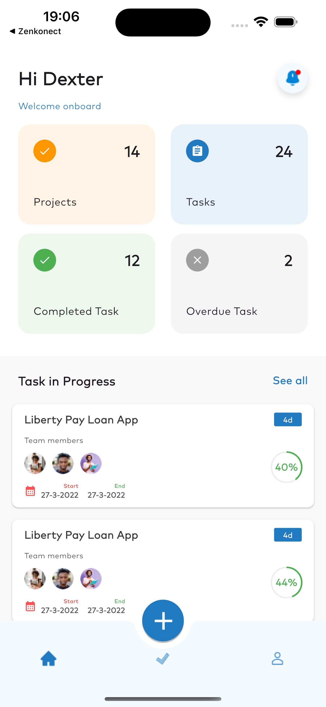
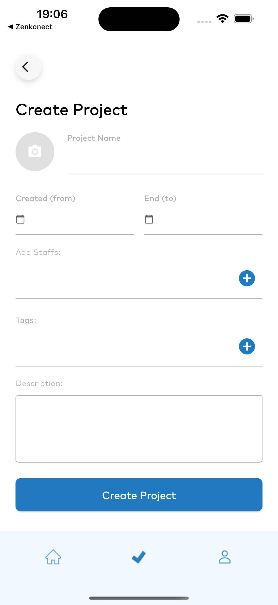
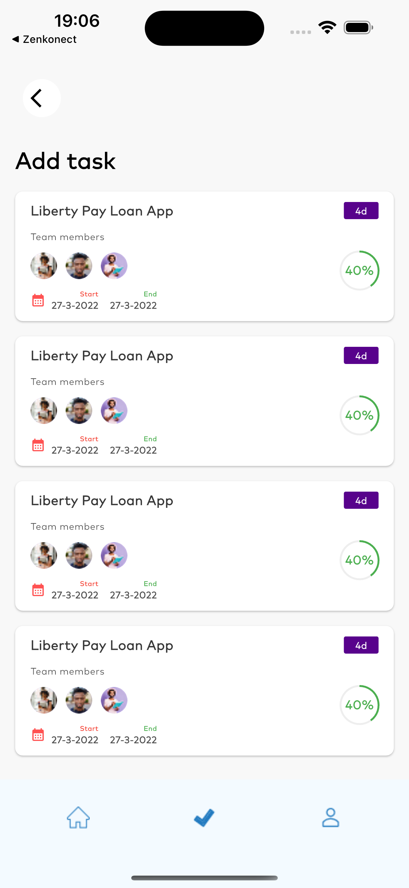
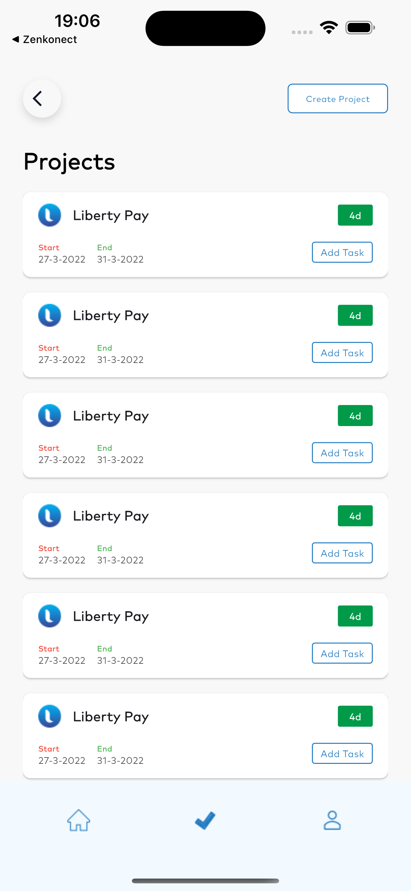
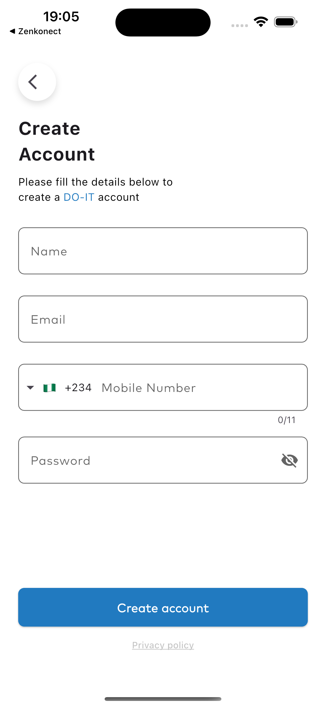
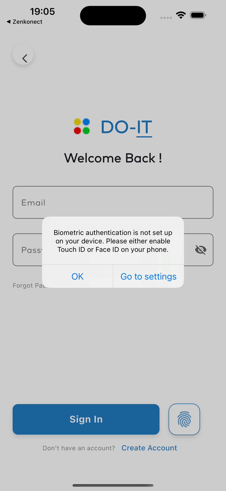

# 📊 DO-IT

A clean and modern Flutter mobile app for managing **projects** and **tasks**, following the **MVC (Model-View-Controller)** architecture.

<p align="center">
  
  
  
  
</p>


## 🚀 Some Features

- 📂 **Create Projects** with name, start/end dates, tags, team members, and description.
- 📋 **View Projects** in a clean card-based UI with duration indicators and quick action buttons.
- ✅ **Add Tasks** under projects, assign members, and track progress with circular indicators.
- **Biometric Authentication** to log in to the app.
- 👥 Beautiful avatars for team collaboration.
- 🧭 Simple and intuitive **bottom navigation**.


---

## 🧠 Architecture

This project uses the **MVC architecture**:

```

lib/
├── models/        # Data classes 
├── views/         # UI screens
├── controllers/   # Business logic
├── widgets/       # Reusable components
└── main.dart      # Entry point

````

---

## 🖼 Screenshots


| Task | Projects | Create Account | Authentication | Sign In |
|------|----------|----------------|----------------|---------|
|  |  |  |  |  |


````


